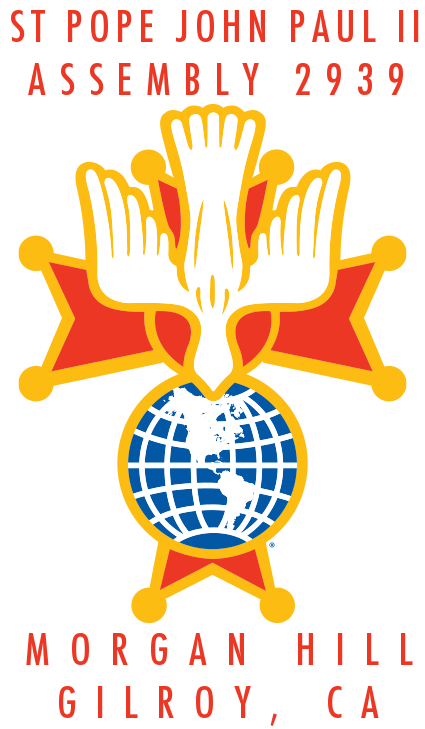
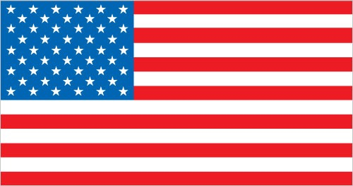
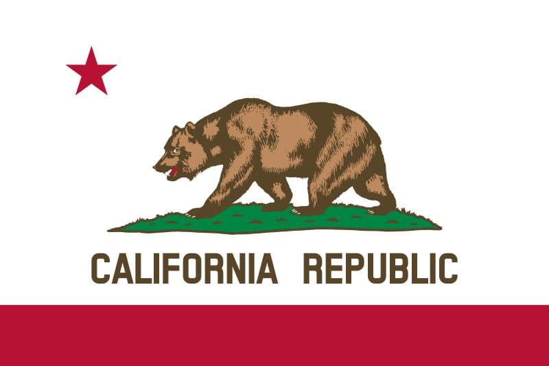
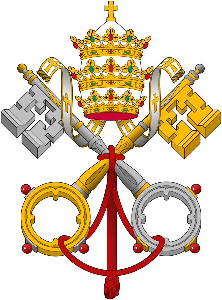
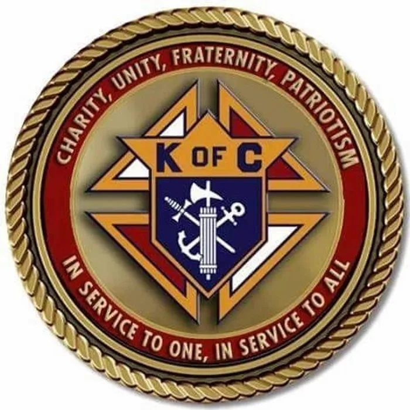

<h2>Knights of Columbus 4th Degree &#x271E; Pope John Paul II Assembly 2939</h2>

<b>The Fourth Degree</b> is the patriotic degree of the order. On February 22, 1900, the first exemplification of the Fourth Degree was held in New York City. To the three principles of our Order: Charity, Unity and Fraternity, the final lesson that was added is the virtue of patriotism. The focus of the Fourth Degree is on this principle, an abiding love for and devotion to one's country. The primary purpose of the Fourth Degree is to foster the spirit of patriotism by promoting responsible citizenship and a love of and loyalty to the Knights' respective countries through membership in local Fourth Degree groups called Assemblies.
 

<b>IN SERVICE TO THE MORGAN HILL AND GILROY COMMUNITIES</b>
 
 
 

