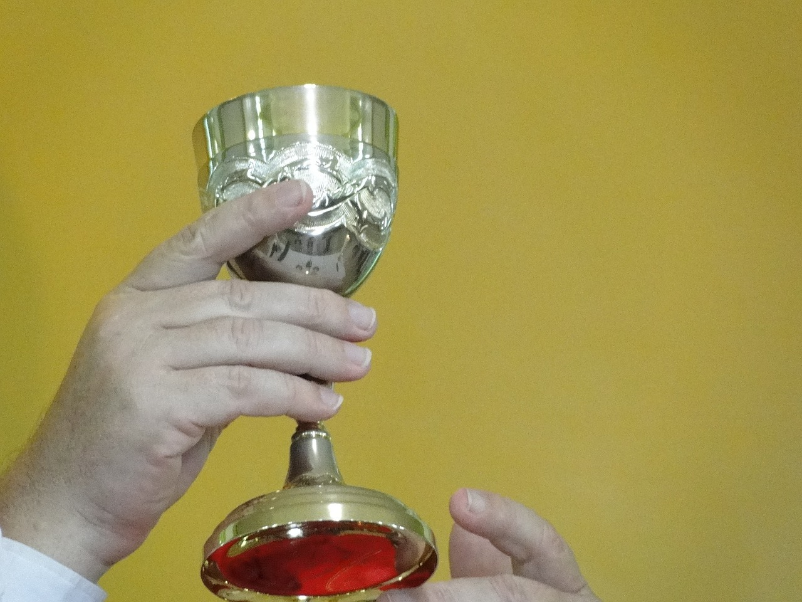
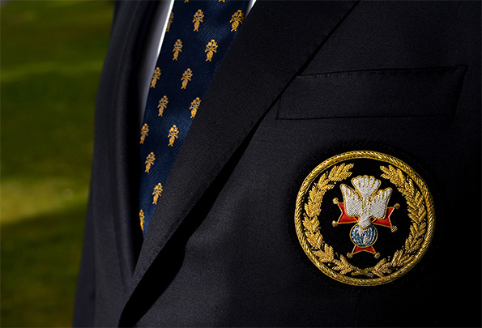
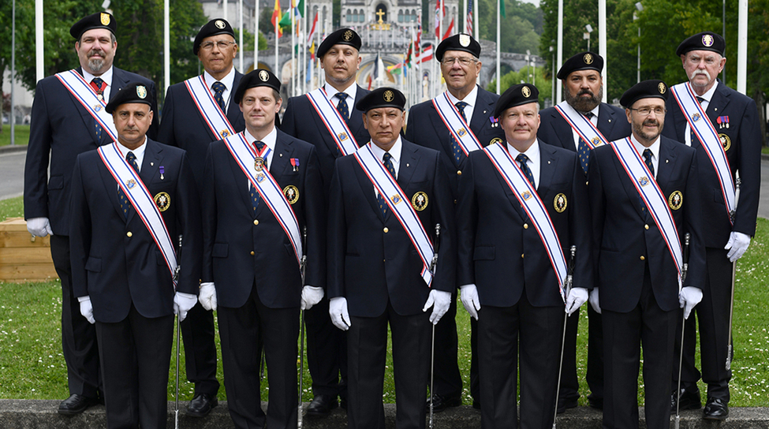
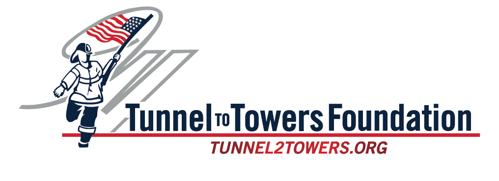

<!-- KofC Assembly 2939 Morgan Hill / Gilroy, CA  -->
<!-- Assembly Projects                            -->

<!-- Beginning of Main Table -->
<table><tr><td></td><td>

<!-- Beginning of Main Table Items -->

</td><td></td></tr><tr><td></td><td><h2>
<em>Wreaths Across America</em></h2>
The Fourth Degree of the Knights of Columbus is the <em>PATRIOTIC</em> degree of the Order. 
There is nothing more patriotic than honoring the graves of our fallen local
Veteran Heroes. For the past three years we have made this a major project both 
financially and as a service project.

</td><td></td></tr><tr></tr><tr></tr><tr></tr><tr></tr><tr></tr><tr><td></td><td>   

</td><td></td></tr><tr><td></td><td><h2>
<em>The Chalice Program</em></h2>
The chalice program is available to any member of the assembly. Members who join the
program agree to purchase a chalice to be given to a priest after the passing of the
member. The members name is engraved on the base of the chalice as a memorial to that
member. Please contact the worthy Comptroller to take part in this program.

</td><td></td></tr><tr></tr><tr></tr><tr></tr><tr></tr><tr></tr><tr><td></td><td>     
      
</td><td></td></tr><tr><td></td><td><h2>
<em>Honor Guard Regalia</em></h2>
During the convention, the Good of the Order Committee stated: “We commend all of the
faithful Sir Knights who have proudly worn the Fourth Degree regalia, bringing much
respect to the Order. With the new Fourth Degree uniform, recently approved by the Board
of Directors, this honor and respect associated with Sir Knights will remain, and it will
open the door more widely for a new generation to join their ranks. In a spirit of unity,
let us assist with a smooth transition to this new uniform and encourage it to be worn
with great dignity and pride.”

</td><td></td></tr><tr></tr><tr></tr><tr></tr><tr></tr><tr></tr><tr><td></td><td>     
      
 Color Corps / Diocese of Cleveland</td><td></td></tr><tr><td></td><td><h2>
<em>Color Corps</em></h2>
Members of the 4th Degree are eligible to become part of the Color Corps.
Perhaps you have seen the Color Corps in a parade, a funeral or a liturgical event in the church.
With our knightly garb, maybe you have seen us, as have millions, on television.
The Color Corps is the highly visible arm of the Knights of Columbus.
Color Corps members exemplify all four principles of the Knights of Columbus.
* <em>Charity</em> by free and willing sacrifice of time and energy to practice and perform the ceremonials.
* <em>Unity</em> by coordinated drill in a body of men.
* <em>Fraternity</em> though membership in a close-knit group and esprit de corps.
* <em>Patriotism</em> -- Precision drills are a salute to God and our country. They visually exhibit a love for both.

      

</td><td></td></tr><tr><td></td><td><h2>
<em>Support for Patriotic Charities</em></h2>
Pope John Paul II Assembly 2939 provides annual or biennial finacial donations to select patriotic charitable organizations in the US.

</td><td></td></tr><tr></tr><tr></tr><tr></tr><tr></tr><tr></tr><tr><td></td><td>     
      
      
<!-- END OF MAIN TABLE -->      
</td><td></td></tr></table>
